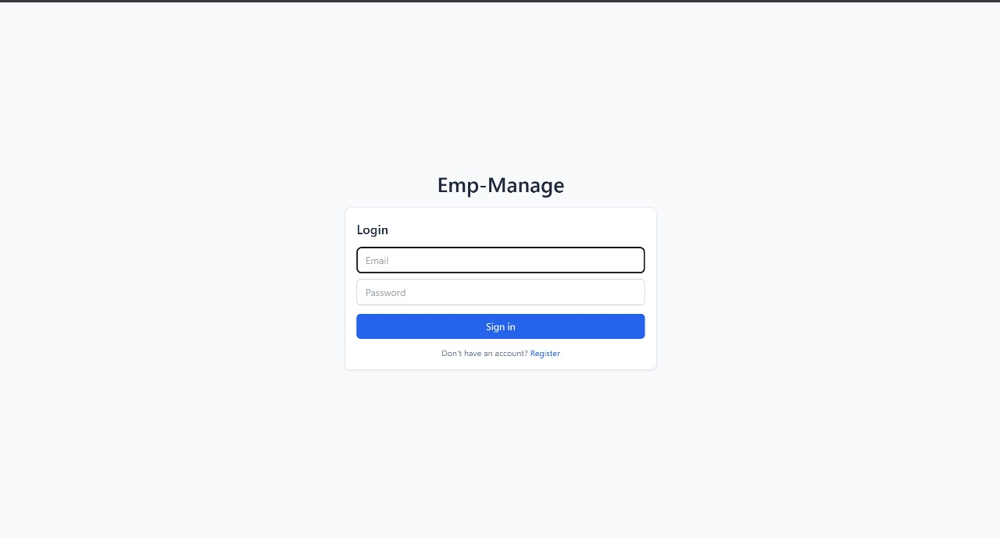
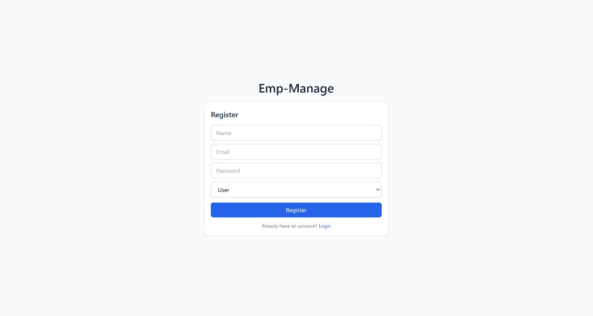
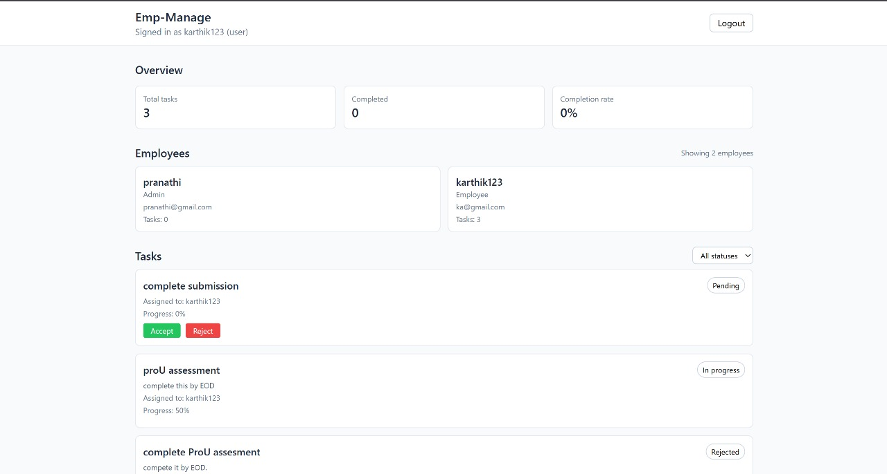
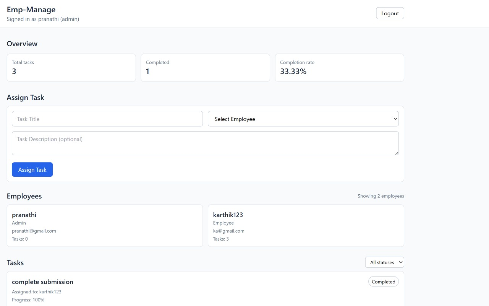

# 📘 Employee Task Management System — Fullstack Web App

A complete employee task tracking system built as part of the **ProU Technology Fullstack Internship Coding Challenge**.

This system includes secure authentication, admin dashboard, employee dashboards, task assignment, task acceptance, and progress tracking.

---

## 🚀 Project Overview

### 👨‍💼 Admin Features
- View all employees  
- Assign tasks to specific employees  
- View all tasks  
- Track employee task progress  
- Dashboard with analytics  
- Secure role-based access  

### 👨‍🔧 Employee Features
- View only tasks assigned to them  
- Accept or reject tasks  
- Update task progress (25%, 50%, 75%, 100%)  
- Personal dashboard metrics  

### 🔗 Shared Features
- Login & Register system  
- JWT-based authentication  
- MongoDB database  
- Clean UI (React + TailwindCSS)  

---

## 🛠️ Tech Stack

### **Frontend**
- React (Vite)
- TailwindCSS
- Axios

### **Backend**
- Node.js
- Express.js
- MongoDB (Mongoose)
- JWT Authentication
- bcryptjs

---

---

## 📸 Screenshots

> Place your images inside a folder named **assets/** in your repository.

### 🔐 Login Page

### 📝 Register Page

### 👨‍🔧 Employee Dashboard

### 👨‍💼 Admin Dashboard

---

## ⚙️ Setup Instructions

### 🔧 Backend Setup

cd backend
npm install

Create .env:

MONGO_URI=your_mongodb_connection_url
JWT_SECRET=your_secret_key
PORT=5000

Run backend:

npm run dev

Backend URL:
http://localhost:5000

💻 Frontend Setup
cd frontend
npm install

Create .env:

VITE_API_URL=http://localhost:5000

Run frontend:

npm run dev

## 📡 API Endpoints

---

### 🔐 Auth

| Method | Endpoint            | Description       |
|--------|----------------------|-------------------|
| POST   | `/api/auth/register` | Register user     |
| POST   | `/api/auth/login`    | Login and get JWT |

---

### 👥 Employees

| Method | Endpoint          | Description                |
|--------|--------------------|----------------------------|
| GET    | `/api/employees`   | Admin: Fetch all employees |

---

### 📋 Tasks

| Method | Endpoint                     | Description                |
|--------|-------------------------------|----------------------------|
| GET    | `/api/tasks`                  | Get all tasks             |
| POST   | `/api/tasks`                  | Admin assigns a task      |
| PATCH  | `/api/tasks/:id/accept`       | Employee accepts task     |
| PATCH  | `/api/tasks/:id/reject`       | Employee rejects task     |
| PATCH  | `/api/tasks/:id/progress`     | Employee updates progress |
| PUT    | `/api/tasks/:id/status`       | Admin updates task status |

---

### 📊 Dashboard

| Method | Endpoint          | Description           |
|--------|--------------------|-----------------------|
| GET    | `/api/dashboard`  | Get summary analytics |

---

## 📊 Key Features Delivered

✔ JWT Authentication  
✔ Role-Based Authorization (Admin / Employee)  
✔ Task Assignment Workflow  
✔ Accept / Reject / Progress Update  
✔ Dashboard Analytics  
✔ Clean UI with TailwindCSS  
✔ Full REST API Architecture  

---

## 📝 Conclusion

This project successfully completes the **ProU Fullstack Internship Assignment**, demonstrating:

- Fullstack development skills  
- Real-world REST API design  
- Secure authentication & authorization  
- React + Tailwind UI development  
- MongoDB database modeling  
- Clean and maintainable architecture  

---

